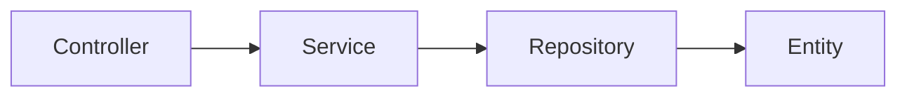

The host is the application's composition entry point; a plugin is a business-module boundary. Keep startup and deployment configuration in the Starter and business behavior in the Plugin so modules can be tested and reused independently.

## Recommended layout

```text
MyApp.Plugin/
  MyAppPlugin.cs
  Controllers/
  Models/
  Services/
  Repositories/
  Entities/
  plugin.yaml
MyApp.Starter/
  Program.cs
  config/app.yaml
```

Keep dependencies flowing `Controller -> Service -> Repository -> Entity`. Controllers handle HTTP input, VO mapping, and response wrappers. Services return DTOs and coordinate business logic. Repositories own persistence and tenant boundaries. Database entities should not become the public API contract.



## Two startup entry points

The [quick start](/en/asgard/docs/quick-start/) uses `PluginWebAppDefaults.RunAsync<TPlugin>()`. For explicit service hooks or multiple built-in plugins, use the host directly. `MyAppPlugin` below is the implementation from the quick start:

```csharp
using Asgard.Abstractions.AspNetCore.Extensions;
using Asgard.Yggdrasil.AspNetCore;
using Microsoft.AspNetCore.Builder;

var builder = YggdrasilHost.CreateBuilder("config/app.yaml")
    .UseBuiltInPlugin<MyAppPlugin>()
    .AfterServiceRegistration(services =>
    {
        // Add application-specific registrations here.
    })
    .ConfigureMiddleware(app =>
    {
        _ = app.UseAsgardExceptionHandler()
            .UseHttpsRedirection();
    });

await using var app = await builder.BuildAsync();
await app.RunAsync();
```

`BuildAsync()` composes the application; `RunAsync()` drives startup, execution, and shutdown. The job scheduler is prepared during Build and may trigger only after host startup. Calling Build alone does not start jobs.

## Startup phases and hooks

1. Constructing the builder first reads host and bootstrap-log settings from the main YAML file
2. After `BeforeConfigurationLoad`, the host merges main YAML, environment YAML, environment variables, and command-line values; it then calls `AfterConfigurationLoad`
3. Module configuration is validated, and enabled infrastructure and plugin services are prepared
4. `BeforeServiceRegistration`, framework registration, and `AfterServiceRegistration` compose the container; Swagger registration follows
5. The final container is built, the job dependency provider is connected, plugins are initialized, and the Web pipeline is configured
6. `AfterHostBuild` runs; the prepared scheduler starts when the host enters its hosted startup lifecycle

The before-registration hook is not a universal override mechanism: later registrations may affect the same service. Inspect registration behavior, lifetime, and ordering before replacing an implementation. Do not call plugin `GetService<T>()` during configuration or service registration.

## Plugin lifecycle

When deriving from `PluginBase`, implement the relevant protected hooks:

- `OnConfigureServicesAsync`: register through `IPluginServiceConfigurationContext.Services`; do not resolve a container that has not been built
- `OnInitializeAsync`: initialize dependencies after the final provider becomes available
- `OnStartAsync`: start module behavior; the framework also reads plugin job configuration
- `OnConfigureMiddlewareAsync`: add behavior at the plugin middleware position
- `OnStopAsync`: stop accepting work and finish module shutdown
- `OnDisposeAsync`: release resources owned by the plugin

Do not infer a complete runtime state machine from every `PluginState` enum value. Test actual lifecycle methods and failure paths. External DLL plugins introduce loading, dependency, and unloading concerns; adopt them once the built-in module boundary is stable.

## Fixed Web pipeline positions

The current host composes this sequence:

1. Static files
2. Request Trace
3. Routing
4. CORS, when enabled
5. Instance-wide and IP rate limiting, when enabled
6. Built-in JWT authentication, when enabled
7. Asgard tenant context
8. The `ConfigureMiddleware` callback
9. Plugin middleware
10. User rate limiting, when enabled
11. Authorization
12. Swagger, health checks, the development TsGen endpoint, and controllers

The callback has a defined position; it does not provide arbitrary insertion between every built-in middleware component. Static files run before authentication and authorization and are appropriate for public assets. The [security guide](/en/asgard/docs/security/) explains the content-protection boundary.

## Shared context and ownership

`AbsAsgardContext` groups caching, messaging, jobs, identity, Trace, and other capabilities. Optional modules can be absent, so check dependencies explicitly. The standard Yggdrasil host still registers `NullAsgardCache` when caching is disabled.

The host owns shared connections, managers, and caches resolved from dependency injection or the context; application code should not dispose them. The creator owns a new application scope or resource. Shutdown first stops jobs and plugins, then releases messaging, caching, Trace, and the remaining infrastructure so stop hooks can still use their dependencies.

## Agent workflow

Load `asgard-host-project` for host changes and `asgard-plugin-lifecycle` for plugin work. Add `asgard-api-development` and `asgard-backend-guard` for layering and API changes. Select the scope in the [skill catalog](/en/skills/docs/catalog/) and verify signatures against current source.

## Source references

These links point to the implementation. Repository access is required to open the source.

- [Host build and hooks](https://github.com/BenLampson/Asgard/blob/7fff18e7f2517aa03d416f70cb452cc616e6c386/src/Host/Asgard.Yggdrasil.AspNetCore/YggdrasilHostBuilder.cs)
- [Pipeline and configuration order](https://github.com/BenLampson/Asgard/blob/7fff18e7f2517aa03d416f70cb452cc616e6c386/src/Host/Asgard.Yggdrasil.AspNetCore/YggdrasilHostBuilder.Configurator.cs)
- [Service registration](https://github.com/BenLampson/Asgard/blob/7fff18e7f2517aa03d416f70cb452cc616e6c386/src/Host/Asgard.Yggdrasil.AspNetCore/YggdrasilHostBuilder.Services.cs)
- [Plugin lifecycle](https://github.com/BenLampson/Asgard/blob/7fff18e7f2517aa03d416f70cb452cc616e6c386/src/Common/Asgard.Core/Plugin/PluginBase.cs)
- [Hosted startup](https://github.com/BenLampson/Asgard/blob/7fff18e7f2517aa03d416f70cb452cc616e6c386/src/Host/Asgard.Yggdrasil.AspNetCore/AsgardRuntimeHostedService.cs)
- [Runtime shutdown ownership](https://github.com/BenLampson/Asgard/blob/7fff18e7f2517aa03d416f70cb452cc616e6c386/src/Host/Asgard.Yggdrasil.AspNetCore/AsgardRuntimeLifetime.cs)
