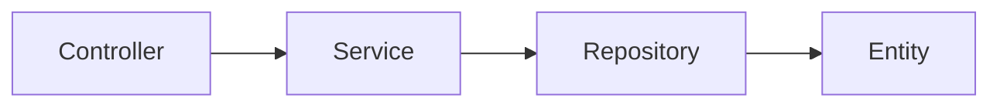

宿主是应用的组合入口，插件是业务模块的边界。让启动和部署配置留在 Starter，让业务能力留在 Plugin，可以独立测试模块并复用它们。

## 推荐目录

```text
MyApp.Plugin/
  MyAppPlugin.cs
  Controllers/
  Models/
  Services/
  Repositories/
  Entities/
  plugin.yaml
MyApp.Starter/
  Program.cs
  config/app.yaml
```

依赖方向保持 `Controller -> Service -> Repository -> Entity`。Controller 负责 HTTP 输入、VO 映射及统一响应；Service 返回 DTO 并编排业务；Repository 维护数据访问与租户边界。不要把数据库实体直接当作公开协议。



## 两种启动入口

[快速开始](/zh/asgard/docs/quick-start/)使用 `PluginWebAppDefaults.RunAsync<TPlugin>()`。需要明确服务钩子或多个内建插件时，使用以下宿主入口，`MyAppPlugin` 沿用快速开始中的实现：

```csharp
using Asgard.Abstractions.AspNetCore.Extensions;
using Asgard.Yggdrasil.AspNetCore;
using Microsoft.AspNetCore.Builder;

var builder = YggdrasilHost.CreateBuilder("config/app.yaml")
    .UseBuiltInPlugin<MyAppPlugin>()
    .AfterServiceRegistration(services =>
    {
        // Add application-specific registrations here.
    })
    .ConfigureMiddleware(app =>
    {
        _ = app.UseAsgardExceptionHandler()
            .UseHttpsRedirection();
    });

await using var app = await builder.BuildAsync();
await app.RunAsync();
```

`BuildAsync()` 构建应用，`RunAsync()` 驱动启动、运行和关闭。作业调度器在 Build 阶段准备，在宿主启动后才允许触发；仅调用 Build 不会启动作业。

## 启动阶段与钩子

1. 构造 Builder 时先读取主 YAML 的宿主与引导日志配置
2. `BeforeConfigurationLoad` 后，合并主 YAML、环境 YAML、环境变量及命令行；随后调用 `AfterConfigurationLoad`
3. 验证模块配置，准备已启用的基础设施与插件服务
4. `BeforeServiceRegistration`、框架服务装配、`AfterServiceRegistration` 完成容器注册；Swagger 服务随后接入
5. 构建最终容器，连接作业依赖提供者，初始化插件并装配 Web 管线
6. 调用 `AfterHostBuild`；进入宿主启动生命周期后启动准备好的作业调度器

前置注册钩子不是通用覆盖点，后续注册可能影响同一服务。需要覆盖时先检查原注册方式、生命周期和调用顺序。不要在配置或服务注册阶段调用插件 `GetService<T>()`。

## 插件生命周期

继承 `PluginBase` 时，业务扩展使用这些受保护钩子：

- `OnConfigureServicesAsync`：通过 `IPluginServiceConfigurationContext.Services` 注册服务，不解析尚未构建的容器
- `OnInitializeAsync`：最终服务提供者已可用，可初始化依赖
- `OnStartAsync`：启动模块逻辑；框架还会读取插件作业配置
- `OnConfigureMiddlewareAsync`：在插件中间件位置接入 Web 行为
- `OnStopAsync`：停止接收工作并完成模块收尾
- `OnDisposeAsync`：释放插件自己持有的资源

不要用所有 `PluginState` 枚举值推演完整运行状态机；按实际生命周期方法和失败路径编写测试。外部 DLL 插件涉及加载、依赖与卸载，适合在内建插件边界稳定后采用。

## Web 管线的固定位置

当前宿主管线按下列顺序装配：

1. 静态文件
2. 请求 Trace
3. Routing
4. CORS（启用时）
5. 实例总量与 IP 限流（启用时）
6. 内建 JWT Authentication（启用时）
7. Asgard 租户上下文
8. `ConfigureMiddleware` 回调
9. 插件中间件
10. 用户限流（启用时）
11. Authorization
12. Swagger、健康检查、开发期 TsGen 端点和 Controllers

中间件回调位于既定位置，不能据此宣称可任意插入每两个内建中间件之间。静态文件先于认证和授权，适合公开资源。[安全指南](/zh/asgard/docs/security/)说明它对内容保护的影响。

## 公共上下文与所有权

`AbsAsgardContext` 聚合缓存、消息、作业、身份和 Trace 等能力。可选模块关闭时，相关能力可能缺失，应明确检查；标准 Yggdrasil 宿主在缓存关闭时仍注册 `NullAsgardCache`。

从依赖注入或上下文获取的共享连接、管理器和缓存由宿主拥有，业务代码不要自行 Dispose。业务新建的作用域和资源由创建方负责释放。宿主关闭时先停止作业和插件，再释放消息、缓存及 Trace 等基础设施，让停止钩子仍可使用它们。

## Agent 工作流

修改宿主时加载 `asgard-host-project`，修改插件时加载 `asgard-plugin-lifecycle`；业务分层和 API 变更再加入 `asgard-api-development` 与 `asgard-backend-guard`。从[技能目录](/zh/skills/docs/catalog/)选择所需范围，再以当前源码核对签名。

## 源码依据

以下链接指向对应实现；访问源码需要仓库权限。

- [Host build and hooks](https://github.com/BenLampson/Asgard/blob/7fff18e7f2517aa03d416f70cb452cc616e6c386/src/Host/Asgard.Yggdrasil.AspNetCore/YggdrasilHostBuilder.cs)
- [Pipeline and configuration order](https://github.com/BenLampson/Asgard/blob/7fff18e7f2517aa03d416f70cb452cc616e6c386/src/Host/Asgard.Yggdrasil.AspNetCore/YggdrasilHostBuilder.Configurator.cs)
- [Service registration](https://github.com/BenLampson/Asgard/blob/7fff18e7f2517aa03d416f70cb452cc616e6c386/src/Host/Asgard.Yggdrasil.AspNetCore/YggdrasilHostBuilder.Services.cs)
- [Plugin lifecycle](https://github.com/BenLampson/Asgard/blob/7fff18e7f2517aa03d416f70cb452cc616e6c386/src/Common/Asgard.Core/Plugin/PluginBase.cs)
- [Hosted startup](https://github.com/BenLampson/Asgard/blob/7fff18e7f2517aa03d416f70cb452cc616e6c386/src/Host/Asgard.Yggdrasil.AspNetCore/AsgardRuntimeHostedService.cs)
- [Runtime shutdown ownership](https://github.com/BenLampson/Asgard/blob/7fff18e7f2517aa03d416f70cb452cc616e6c386/src/Host/Asgard.Yggdrasil.AspNetCore/AsgardRuntimeLifetime.cs)
